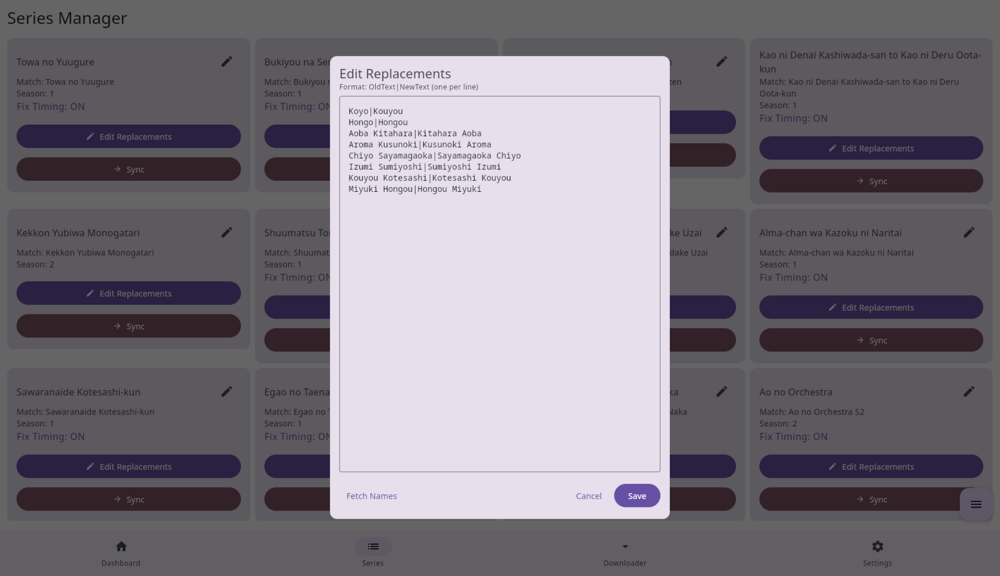
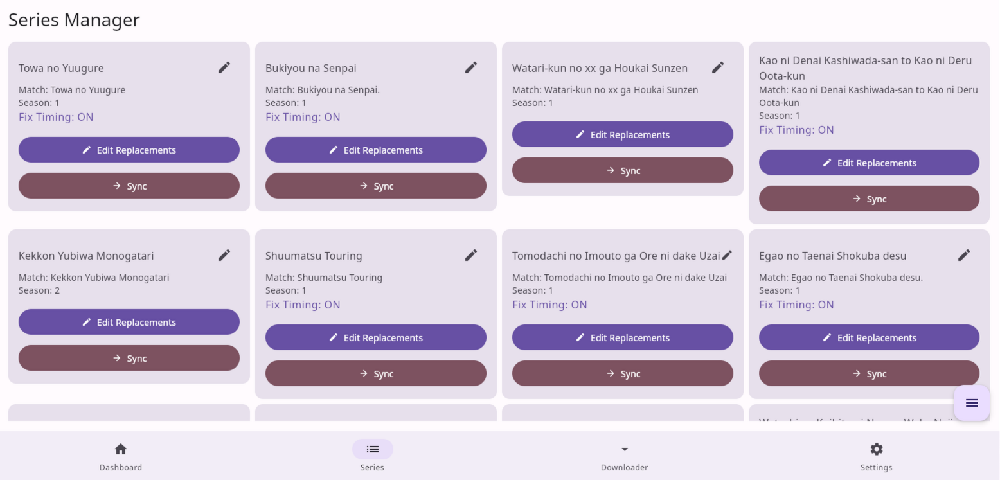
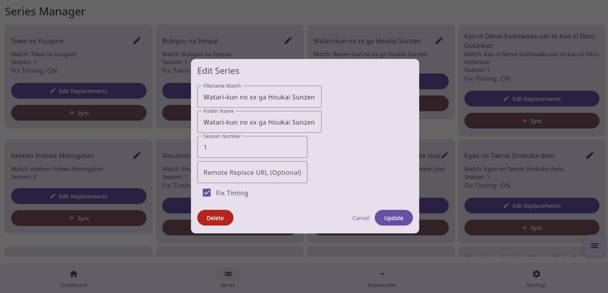
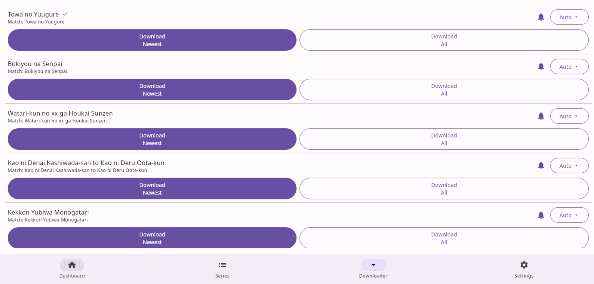
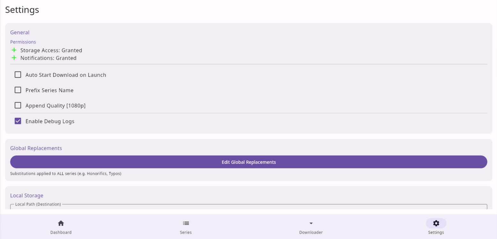
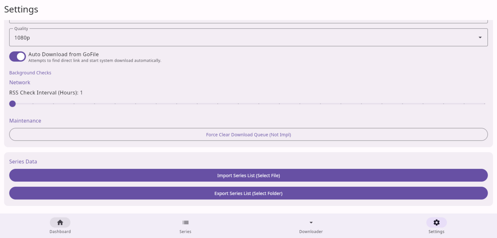

# 🌸 Chou Megumi Download NEXT 🌸

> **The Ultimate Multiplatform Anime Downloader & Manager**

**Chou Megumi Download NEXT** is a complete rewrite of the original Python-based anime manager. It moves away from complex text-configuration and terminal scripts to a simplified, beautiful, and native graphical interface that runs on both your PC and your Android phone.

Instead of just grabbing files, it is a complete **post-processing pipeline** for your anime. It downloads, extracts, fixes subtitles (timing, names, styles), and organizes your library automatically.

---

## 🚀 Comparison: Python vs NEXT

| Feature | Python Version | **NEXT (This Version)** |
| :--- | :---: | :---: |
| **Interface** | CLI / Text Configs | **Native GUI (Material 3)** |
| **Ease of Use** | High Friction (Edit .txt files) | **Point & Click Settings** |
| **Platform** | Desktop Only | **Android + Desktop** |
| **Portability** | Requires Python env | **Standalone App** |
| **Intelligence** | Static Regex | **MAL / AniDB / Anilist + GoFile AI** |
| **Sync** | Basic | **Smart SMB Sync** |

---

## 🌟 Introduction to Features

### 🖥️ Dashboard
The command center of the app.
1.  **Status Overview**: Shows your current connection status (SFTP/SMB) and recent activity logs.
2.  **Start Download Button**: This triggers the **Download Cycle**.
    *   **IF SFTP Mode**: connects to your seedbox, checks for files matching your *Series List*, downloads them, processes them, and deletes the remote copy.
    *   **IF Local Move Mode**: It scans your *Local Source Path* (The drop folder) and processes files found there into your library.
3.  **Active Queue**: Shows files currently being downloaded or processed.

### 📺 Series Manager
This is where you organize your catalog. The interface is designed to be streamlined:

#### 1. Adding a Series
To track a new anime, click the **Add (+)** button.

*   **Match Name**: This is the keyword found in the **filename** (e.g. `Sousou no Frieren`).
*   **Folder Name**: This is what **you** call the series locally (e.g. `Frieren`).
    *   *Tip*: Using the original Romanized Japanese name (e.g. *Shingeki no Kyojin*) is usually preferred over English titles (*Attack on Titan*) for better organization.
*   **Save**: The series is now tracked.

#### 2. Managing a Series (Detail View)
Click/Tap on any series card to open the advanced tools.

*   **Subtitle Timing Fix**: Toggle this ON to have the app automatically re-time subtitles.
    *   *What it does*: It analyzes the subtitle stream and snaps start/end times to keyframes and closes annoying micro-gaps between dialogue.
    *   **Performance Note**: This feature is computationally intensive. It is recommended for **PCs** or **High-End Phones** (Snapdragon 8 Gen 1+). On older phones, this might significantly slow down processing time.

*   **Series Specific Replacements**:
    This allows you to "Remaster" the subtitles for just this show. You can add rules manually, or first use the **Smart Name Fetcher** to pree-fill character names for you.
    *   **Smart Name Fetcher**: Click **Fetch Names** to pull character data from **MAL**, **AniDB**, or **Anilist**.
        *   **Purpose**: Many official translations use Western name order (First Last) or questionable romanizations. This tool automatically generates rules to **switch names back to Japanese Order** (Last First) or fix the spelling.
        *   *Example*: `Ryo` | `Ryou` (Fixing spelling)
        *   *Example*: `Nagisa Furukawa` | `Furukawa Nagisa` (Restoring Name Order)
    *   **Import External Lists**:
        *   You can paste a URL to a raw text file (e.g. Pastebin/GitHub Gist) created by other users. The app will download replacements from there, allowing communities to share fix lists.
    *   **Syntax**: `Original Text` | `New Text`

### 📥 Downloader & RSS

*   **RSS Automation (AnimeTosho)**: The app monitors the **AnimeTosho** RSS feeds for series added to Series Manager for your followed groups.
*   **Group Priority**:
    *   In Settings, you list your groups (e.g. `SubsPlease, Erai-raws, HorribleSubs`).
    *   **Order Matters!** The app prioritizes the **first** group in your list.
    *   *Example*: If `SubsPlease` is 1st and `Erai-raws` is 2nd, the app will always grab the `SubsPlease` release if both are available. It only grabs `Erai-raws` if `SubsPlease` is missing.
*   **GoFile AI**: If the AnimeTosho feed points to a GoFile link (common for direct downloads), the app launches a smart internal engine to bypass the GoFile webpage, solve challenges, and extract the direct video link automatically, then download and process it.

---

## ⚙️ Settings Explained

### 📱 Android Permissions
*   **Storage**: Required to read/write your anime files.
*   **Notifications**: We run a "Foreground Service". This is critical on Android to prevent the system from killing the app while it's downloading a 2GB file in the background.

### 🔧 Automation Options
*   **Auto Start Download**:
    *   When you open the app, it immediately runs the "Start Download" cycle. Great for "Open and forget" usage.
*   **Prefix / Append Quality**:
    *   *Prefix*: Renames `[Group] Show - 01.mkv` to `Show - S01E01.mkv`.
    *   *Append Quality*: Adds `[1080p]` to the end of the filename if detected.
*   **Debug Logs**: Leave this **OFF** unless you have issues.

### 📝 Global Replacements (Settings)
This menu configures **Global Rules** that apply to **ALL** anime. Use this for universal fixes like restoring common words that are often overlocalized.

*   **Priority Logic**:
    1.  **Series Specific Rules** (Defined in Series Manager) are applied **FIRST**.
    2.  **Global Rules** (Defined here) are applied **SECOND**.
    *   *This allows you to override a global rule for a specific show if needed.*

*   **Direction**: `Original Text` | `New Priority Text`
*   **Common Use Cases**:
    *   `Big Brother` | `Onii-chan` (Restoring honorifics)
    *   `Pigtails` | `Twintails` (Fixing common words)
    *   `Boxed Lunch` | `Bento`

### 📂 Storage & Paths
*   **Local Path**: Your final library location (e.g. `/sdcard/Anime` or `D:\Anime`).
*   **Local Source Path**: This is your **Temp / Drop Folder**.
    *   If you download files manually (via Torrent or Browser), put them here. The app will "consume" them from here, process them, and move them to the final `Local Path`.
*   **Local Files Only (Skip FTP)**:
    *   **ON**: Disables SFTP. The app only looks at the `Local Source Path`.
    *   **OFF**: The app connects to your SFTP server.
*   **Temp Directory**: If downloading via SFTP, the app uses the system cache. Ensure you have space!

### ☁️ SFTP & Networking
*   **SFTP Options**: Host, User, Password for your Seedbox/VPS.
*   **Batch Downloading**:
    *   **ON (Recommended)**: Downloads *all* pending files in parallel first, then processes them sequentially.
    *   **OFF**: Download -> Process -> Delete -> Repeat.
*   **SMB Sync (Multi-Device)**:
    *   Keeps your phone library in sync with your PC/NAS.
    *   **Sync Logic**: Checks file sizes. If different, it updates.

### 📶 RSS Advanced
*   **RSS Check Interval**: How often the background service checks AnimeTosho for new releases..

### 📤 Import / Export
*   **Import**: Loads a `serieslist.megumi` (old format) or JSON file.
*   **Export**: Backs up your configuration.

---

## 💻 Supported Systems
*   **Android**: Android 8.0 (Oreo) or higher.
*   **Linux**: Any modern distro (Debian/Ubuntu/Arch). **Requires `ffmpeg` installed.**
*   **Windows**: Windows 10/11. **Requires `ffmpeg` installed and added to PATH.**

---

## 🆘 FAQ / Troubleshooting

**Q: My app crashes on launch!**
A: Check for a `.app.lock` file in your megumi folder (`~/.megumidownload/` on PC). If the app closed badly, delete this file.

**Q: [Linux/Windows] Processing fails or "FFmpeg not found"?**
A: This app relies on **FFmpeg** for video processing.
*   **Linux**: Run `sudo apt install ffmpeg` (or `pacman -S ffmpeg`).
*   **Windows**: Download FFmpeg from [gyan.dev](https://www.gyan.dev/ffmpeg/builds/).
    *   **Option A (Recommended)**: Extract `ffmpeg.exe` and add its folder to your **System PATH**.
    *   **Option B (Easy)**: Just verify where `MegumiDownload.exe` is installed, and drop `ffmpeg.exe` **in the same folder** (next to the app executable).

**Q: [Windows] Files are stuck / Access Denied?**
A: Windows Defender or Antivirus often locks video files while they are being written. Add the `MegumiDownload` folder to your exclusions.

**Q: [Android] Downloads stop when screen is off?**
A: Some aggressive battery savers kill the background service. Go to **App Info -> Battery** and set to **"Unrestricted"**.

Made with ❤️ by [HououinKyouma01](https://github.com/HououinKyouma01).
*El Psy Kongroo.*
